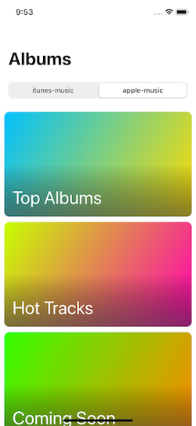
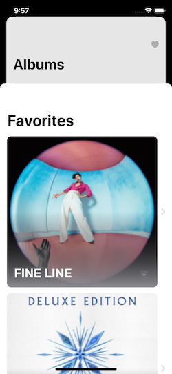

# TopChecker
Just a fun little example app that uses Swift UI to check some of the top albums/songs via Apple Music RSS feeds. 

Just to give some easy context to how the app looks/feels, here are some screenshots and walkthroughs. The goal of this app was to do some simple downloading and showing of images with the use of SPM. This has some gesture recognizers and animations on the home view. It uses some navigation controls to show/hide the favorties with an app persistance store. Basic functionality and some in-code comments to show this for a lunch box presentation at work(so when you see "version 1 or version 2" that is why. 

Home Page: 

Top Albums Page:

Album Detail Page with the heart tapped (so this will change the home screen look):

Share button tapped:

Home page with favorites because now we have them:

Favorites page mid animation to show that it comes from the bottom with our two albums favorited:

